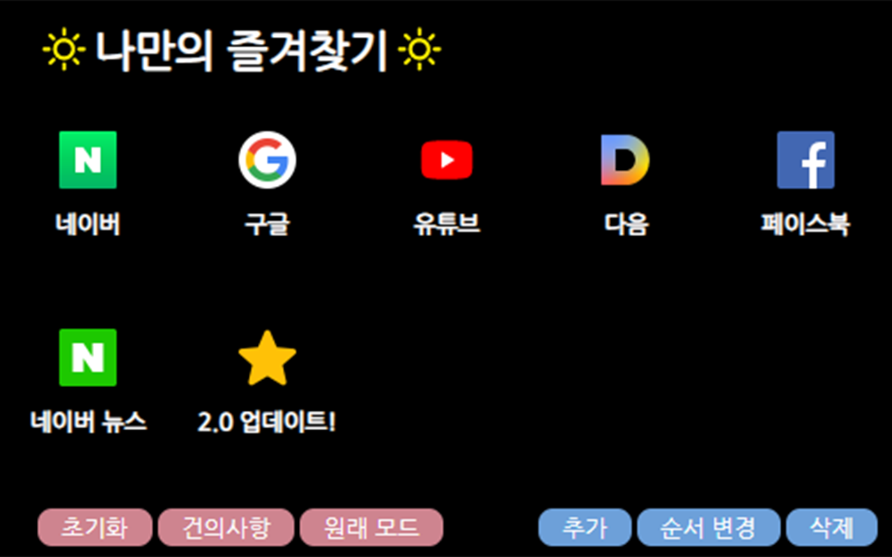
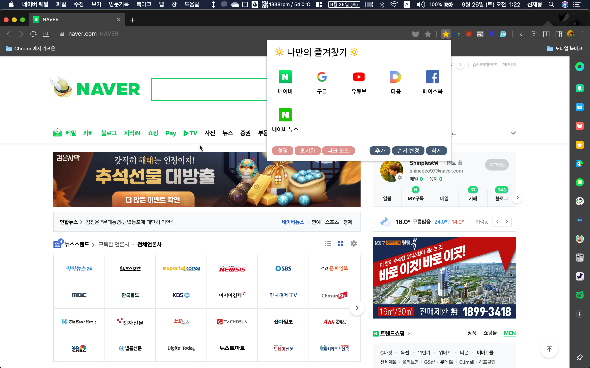

# 🔆나만의 즐겨찾기🔆
<p align="left">
<a href="https://opensource.org/licenses/MIT"></a>
</p>                                                                                                                            
<p align="left">
네이버 웨일 브라우저(데스크탑)에서 즐겨찾기 관리를 보다 편하게 해주는 확장 프로그램입니다. 
</p>
<p align="left">

</p>

<p align="left">
웨일스토어 다운로드 수 1000돌파!
</p>

<p>  </p>

<p align="left">

</p>

<p>  </p>

<p align="left">

</p>

## Download
<p align="left"> 
    click <a href="https://store.whale.naver.com/detail/fgbmpabhnfaelaomcgjejamnjkmhdocm">here</a> to add this extension!
</p>
<p>
<a href="https://store.whale.naver.com/detail/fgbmpabhnfaelaomcgjejamnjkmhdocm">여기</a>를 눌러 웨일에 추가하세요!
</p>

## Library
SweetAlert
https://sweetalert.js.org/
## Usage
Script.js에 아래부분을 바꾸어 설정하면 응용이 가능합니다. 

```javascript
var gachonPages = [
    ["네이버", "https://www.naver.com/", "https://www.naver.com/favicon.ico?1"],
    ["구글", "https://www.google.co.kr/", "https://www.google.co.kr/favicon.ico"],
    ["유튜브", "https://www.youtube.com/", "https://s.ytimg.com/yts/img/favicon_32-vflOogEID.png"],
    ["다음", "https://www.daum.net/", "https://www.daum.net/favicon.ico"],
    ["페이스북", "https://ko-kr.facebook.com/", "https://static.xx.fbcdn.net/rsrc.php/yo/r/iRmz9lCMBD2.ico"],
    ["네이버 뉴스", "https://news.naver.com/", "https://ssl.pstatic.net/static.news/image/news/2014/favicon/favicon.ico"],
]; //기본페이지들 
```


## License
```
MIT License

Copyright (C) 2019 shinplest

Permission is hereby granted, free of charge, to any person obtaining a copy
of this software and associated documentation files (the "Software"), to deal
in the Software without restriction, including without limitation the rights
to use, copy, modify, merge, publish, distribute, sublicense, and/or sell
copies of the Software, and to permit persons to whom the Software is
furnished to do so, subject to the following conditions:

The above copyright notice and this permission notice shall be included in all
copies or substantial portions of the Software.

THE SOFTWARE IS PROVIDED "AS IS", WITHOUT WARRANTY OF ANY KIND, EXPRESS OR
IMPLIED, INCLUDING BUT NOT LIMITED TO THE WARRANTIES OF MERCHANTABILITY,
FITNESS FOR A PARTICULAR PURPOSE AND NONINFRINGEMENT. IN NO EVENT SHALL THE
AUTHORS OR COPYRIGHT HOLDERS BE LIABLE FOR ANY CLAIM, DAMAGES OR OTHER
LIABILITY, WHETHER IN AN ACTION OF CONTRACT, TORT OR OTHERWISE, ARISING FROM,
OUT OF OR IN CONNECTION WITH THE SOFTWARE OR THE USE OR OTHER DEALINGS IN THE
SOFTWARE.
```

